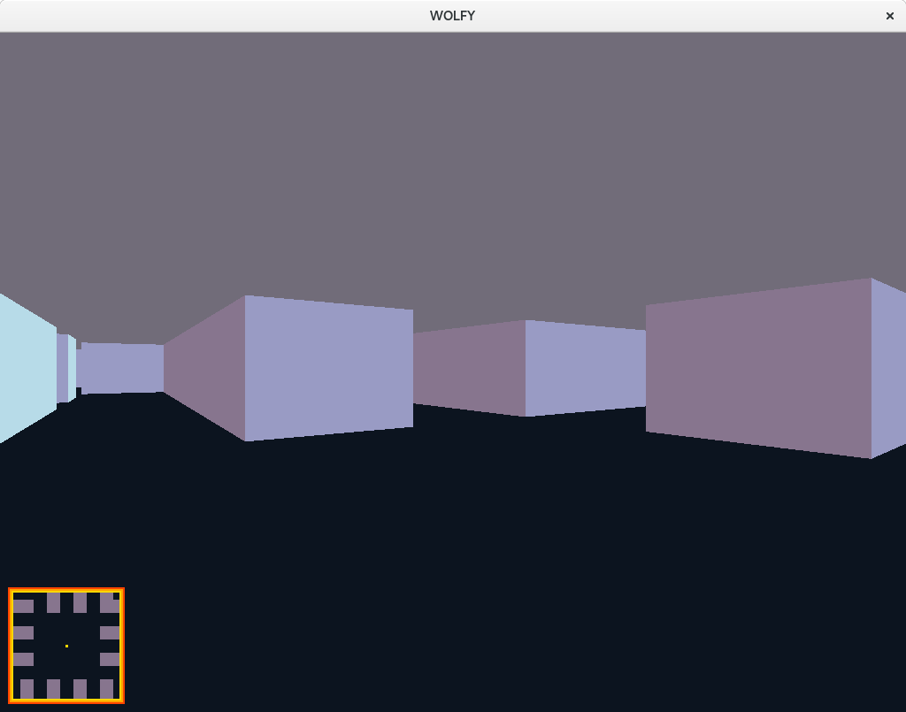

# Wolf3d
An epitech raytcasting project based on the famous Wolfenstein game.

## Commands

./wolf3d [FILE].ini

While in game you can :
- move with Z,Q,S,D
- look around with the mouse (up/down trough tiring)
- change map with P/M

